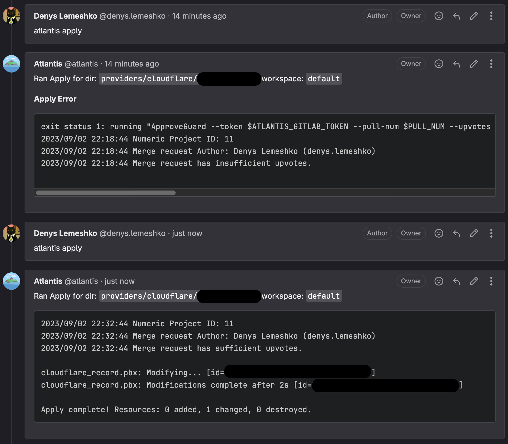

# 🚪🔒🗝️ ApproveGuard

## Overview

This CLI tool checks the number of upvotes for a GitLab Merge Request (MR). It is designed to run within an Atlantis workflow and aims to fill the gap in features between GitLab Community Edition and the Enterprise Edition.

The CLI tool takes three parameters:

1. GitLab Token
2. Merge Request URL
3. Upvotes Threshold

It returns an exit code of `0` if the number of upvotes meets or exceeds the specified threshold, and `1` otherwise.

### GitLab Community Edition?

GitLab Community Edition is an open-source platform that provides a wide array of baseline features for version control and project management. However, certain enterprise-level features like multiple approvers are not available in the CE version. This CLI tool aims to supplement that functionality by providing an automated way to check for upvotes on Merge Requests.

## 🌟 Features

- Check the upvote count for a specific Merge Request
- Customize the upvote threshold to suit your project needs
- Written in Go for cross-platform compatibility

## Requirements

- Go 1.21
- Atlantis 0.19.X
- GitLab API Token with `read_api` access level

## 🚀 Installation

To build the project, run:

```
CGO_ENABLED=0 go build -o ./ApproveGuard --ldflags '-w -s -extldflags "-static" -X main.version=0.0.1' .
```

## ⚙ Options

- `--token`: GitLab API token (can also be set via `GITLAB_TOKEN` environment variable)
- `--upvotes`: The minimum required upvotes (can also be set via `UPVOTES` environment variable)
- `--url`: The Merge Request URL (can also be set via `PULL_URL` environment variable)
- `--pull-num`: The Merge Request ID (can also be set via `PULL_NUM` environment variable)

## ▶️ Running

```bash
$ export GITLAB_TOKEN=glpat-XXX
$ export PULL_NUM=1
$ export PULL_URL=https://gitlab.example.com/denys.lemeshko/downstream/-/merge_requests/1
$ ./ApproveGuard -h
Check upvotes for a GitLab MR

Usage:
  ApproveGuard [flags]

Flags:
  -h, --help           help for BlockMaster
      --pull-num int   Merge request ID (or set PULL_NUM env var) (default 1)
      --token string   GitLab token (or set GITLAB_TOKEN env var) (default "glpat-XXX")
      --upvotes int    Upvote threshold (or set UPVOTES env var) (default 1)
      --url string     Merge request URL (or set PULL_URL env var) (default "https://gitlab.example.com/denys.lemeshko/downstream/-/merge_requests/1")
  -v, --version        version for BlockMaster
```

👍

```bash
$ ./ApproveGuard
2023/09/02 04:29:47 Numeric Project ID: 91
2023/09/02 04:29:47 Merge request Author: Denys Lemeshko (denys.lemeshko)
2023/09/02 04:29:47 Merge request has sufficient upvotes.
$ echo $?
0
```

👎

```bash
$ ./ApproveGuard
2023/09/02 04:30:07 Numeric Project ID: 91
2023/09/02 04:30:08 Merge request Author: Denys Lemeshko (denys.lemeshko)
2023/09/02 04:30:08 Merge request has insufficient upvotes.
$ echo $?
1
```



---

## Atlantis configuration example

`docker-compose.yaml`

```yaml
version: "3.8"

networks:
  traefik-public:
    external: true

services:
  atlantis:
    container_name: atlantis
    image: registry.example.com/docker/atlantis:v0.0.2-d97e6784
    restart: unless-stopped
    logging:
        driver: "json-file"
        options:
            max-file: 5
            max-size: 10m
    expose:
      - "4141"
    command:
      - 'server'
      - '--atlantis-url=https://atlantis.example.com'
      - '--gitlab-webhook-secret=XXX'
      - '--gitlab-user=git'
      - '--repo-allowlist=gitlab.example.com/devops/terraform/*'
      - '--repo-config=/data/repos.yaml'
      - '--write-git-creds'
    volumes:
      - ./repos.yaml:/data/repos.yaml
    networks:
      - traefik-public
    environment:
      - "UPVOTES=2"
      - "ATLANTIS_GITLAB_HOSTNAME=gitlab.example.com"
      - "ATLANTIS_GITLAB_TOKEN=glpat-XXX"
    labels:
      # Explicitly tell Traefik to expose this container
      - "traefik.enable=true"
      # HTTPS Atlantis
      - "traefik.http.routers.atlantis-web-secure.rule=Host(`atlantis.example.com`)"
      - "traefik.http.routers.atlantis-web-secure.tls=true"
      - "traefik.http.routers.atlantis-web-secure.tls.certresolver=myresolver"
      - "traefik.http.routers.atlantis-web-secure.entrypoints=websecure"
      - "traefik.http.routers.atlantis-web-secure.middlewares=robots-tag-header@file,atlantis-auth"
      - "traefik.http.routers.atlantis-web-secure.service=atlantis-web-secure"
      - "traefik.http.services.atlantis-web-secure.loadbalancer.server.port=4141"
      - "traefik.http.services.atlantis-web-secure.loadbalancer.server.scheme=http"
      - "traefik.http.middlewares.atlantis-auth.basicauth.users=lde:XXX"
```

`repos.yaml`

```yaml
repos:
  - id: /.*/
    apply_requirements:
      - approved
      - mergeable
    workflow: terragrunt
workflows:
  terragrunt:
    plan:
      steps:
      - run: echo "Run \"terraform fmt\" command" && terraform fmt -check -diff
      - env:
          name: TERRAGRUNT_TFPATH
          command: "echo terraform$ATLANTIS_TERRAFORM_VERSION"
      - run: bash -o pipefail -c "terragrunt plan -no-color -out=${PLANFILE}"
    apply:
      steps:
      - run: ApproveGuard --token $ATLANTIS_GITLAB_TOKEN --pull-num $PULL_NUM --upvotes 2 --url https://${ATLANTIS_GITLAB_HOSTNAME}/${BASE_REPO_OWNER}/${BASE_REPO_NAME}/-/merge_requests/${PULL_NUM}
      - env:
          name: TERRAGRUNT_TFPATH
          command: 'echo terraform$ATLANTIS_TERRAFORM_VERSION'
      - run: bash -o pipefail -c "terragrunt apply -no-color ${PLANFILE}"
```

## 🤝 Contributing

Contributions to this project are welcome! Please read [CONTRIBUTING.md](CONTRIBUTING.md) for details.

## 📜 License

This project is licensed under the GNU General Public License v3.0 (GPL-3.0). See the [LICENSE](LICENSE) file for details.
